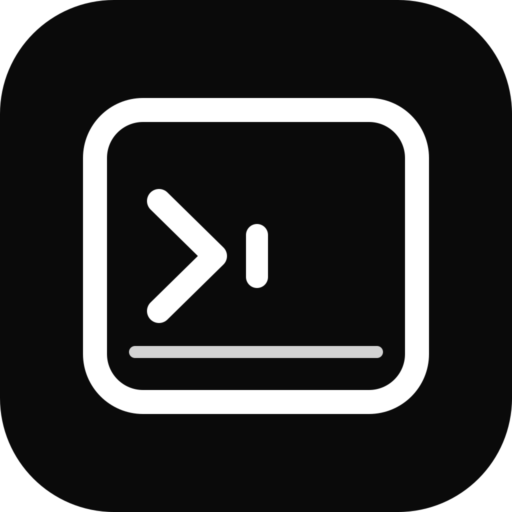

<p align="center">
  
</p>

<h1 align="center">MatTerm</h1>

<p align="center">为 macOS 打造的原生终端工作区。</p>

<p align="center">
  <a href="https://github.com/MattMaBX/MatTerm/releases">下载</a>
  &nbsp;|&nbsp;
  <a href="https://github.com/MattMaBX/MatTerm/issues">反馈问题</a>
  &nbsp;|&nbsp;
  <a href="README.md">English</a>
</p>

MatTerm 面向需要在本地 shell 与 SSH 主机之间频繁切换的 macOS 用户。它使用原生 SwiftUI 和 AppKit 界面、真实 PTY、系统 OpenSSH 客户端以及 Ghostty VT 核心，在保留现代终端工作流的同时，提供贴合 macOS 的使用体验。

**当前版本：** v0.2.0

## 核心特性

- **本地与 SSH 工作区。** 可新建本地终端标签页，并通过与 `~/.ssh/config` 同步的配置快速连接远程主机。
- **可靠的终端渲染。** 支持 ANSI、256 色和真彩色输出，提供可配置回滚缓冲、文本选择与复制，以及适合长输出的原生缓冲滚动。
- **兼容复用器交互。** 当 tmux、Vim 或 screen 接管终端时，鼠标跟踪、分屏大小调整和滚轮事件仍会正确传递给它们。
- **标签页与方向分屏。** 支持向左、向右、向上、向下创建子终端，每个窗格独立处理焦点和光标状态。
- **面向日常使用。** 内置 Tabby 主题，可调字体、行距、光标、透明度和模糊效果，并记住窗口布局。
- **macOS 原生体验。** 支持全屏、标准快捷键、`arm64` 与 `x86_64` 通用构建，以及简体中文和英文界面。

## 获取 MatTerm

### 下载发布版本

1. 在 [Releases](https://github.com/MattMaBX/MatTerm/releases) 下载最新的通用 ZIP。
2. 解压后将 `MatTerm.app` 移动到 `/Applications`。
3. 正常打开应用。若 macOS 对临时签名构建显示 Gatekeeper 提示，请按住 Control 点击应用，选择 **打开**，再确认。

应用要求 macOS 26.0 或更高版本，同时包含 Apple Silicon 与 Intel 架构，在 Apple Silicon Mac 上不需要 Rosetta。

### 从源码构建

构建需要 Swift 6.1 或更高版本，以及 macOS 26 SDK。

```sh
git clone https://github.com/MattMaBX/MatTerm.git
cd MatTerm
./Scripts/build-app.sh
open Build/MatTerm.app
```

构建完成后，会在 `Build/MatTerm.app` 生成带有临时签名的通用 app bundle。检查已有 bundle：

```sh
./Scripts/validate-app.sh Build/MatTerm.app
```

## 常用快捷键

| 操作 | 默认快捷键 |
| --- | --- |
| 新建本地标签页 | `Cmd+T` |
| 关闭标签页 | `Cmd+W` |
| SSH 配置选择器 | `Cmd+Shift+O` |
| 向左、右、上、下分屏 | `Cmd+Shift+H` / `Cmd+Shift+L` / `Cmd+Shift+K` / `Cmd+Shift+J` |
| 下一个或上一个标签页 | `Cmd+Shift+}` 或 `Cmd+Shift+{` |
| 全屏 | `Cmd+Ctrl+F` |

SSH 配置选择器和分屏快捷键可在设置中修改。

## SSH、凭据与配置

MatTerm 使用系统 `/usr/bin/ssh`。身份验证仍由 OpenSSH、SSH Agent 和你选择的身份文件负责；MatTerm 不保存密码或私钥。

- 应用启动时读取 `~/.ssh/config`，并在打开 SSH 配置选择器前刷新内容。
- 新建或编辑配置会更新对应的 `Host` 块；没有匹配项时会追加新的块。
- MatTerm 写入配置时会保留无法识别的指令和无关的主机块。

如果一个主机块包含高级 OpenSSH 配置，或由多个工具共用，编辑后请检查 `~/.ssh/config`。该文件始终是配置来源，也可以随时直接修改。

## v0.2.0 更新

- 改进 ANSI 背景色块、文本对比度和行距对齐。
- 重构普通终端回滚逻辑，使长输出的渲染和滚动更稳定、流畅。
- 加入有效的回滚行数设置、原生文本选择与复制，以及 Cmd+Ctrl+F 全屏支持。
- 让 tmux 触控板滚动更接近普通终端；在普通本地或 SSH shell 中开始输入时，视图会回到实时提示符。

## 当前范围

MatTerm 有意保持聚焦。目前尚未提供专门的端口转发界面，也不支持任意拖拽和重排窗格；现阶段的方向分屏覆盖了主要的窗格工作流。

## 开发

提交 Pull Request 前，请运行终端回归检查：

```sh
./Scripts/check-terminal.sh all
./Scripts/check-appearance.sh
./Scripts/build-app.sh
./Scripts/validate-app.sh Build/MatTerm.app
```

欢迎通过 [GitHub Issues](https://github.com/MattMaBX/MatTerm/issues) 提交问题和功能建议。

## 许可证

MatTerm 使用 [MIT 许可证](LICENSE) 发布。
